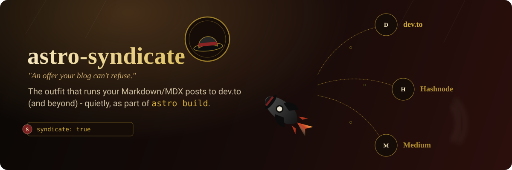

<p align="center">
  
</p>

[](https://github.com/SlashGordon/astro-syndicate/actions/workflows/release.yml)

[](https://github.com/SlashGordon/astro-syndicate/actions/workflows/ci.yml)

# astro-syndicate

An Astro integration that syndicates Markdown/MDX blog posts to external platforms (dev.to, with Hashnode and Medium designed to slot in later) as part of `astro build`.

It hashes each post's title and content, compares that hash against what was stored the last time it synced, and only calls a platform's API when something changed. Posts opt in per provider - `syndicate: { devto: true }` - since a post that suits dev.to doesn't always suit every other platform you've configured. Local images can be uploaded to a host of your choosing and rewritten to absolute URLs before a post goes out, since dev.to has no reliable image-upload API of its own.

Every new post syncs as a draft on dev.to (`published: false`) by default - nothing goes live until you change that yourself. Set `DevToProvider`'s `published: true` (or `DEVTO_PUBLISHED=true`) to have new posts publish immediately instead; either way, an update to an already-synced post never touches that field, so a post you've published by hand stays published.

`canonical_url` is metadata dev.to uses for SEO, not a link it shows readers - so by default the integration also appends a short, visible "originally published on [yourdomain](...)" line to the end of every post's body. Set `backlink: false` in `astro.config.mjs` to turn it off, or pass a function to write your own.

## How it works

1. Something triggers a sync - either `astro build` finishing, or a plain script call. Either way, the actual work is one call to `runSyndication()`, which scans `src/content/blog/` for `.md` / `.mdx` files.
2. For each file, `syndicate` in its frontmatter says which configured providers, if any, it opts into (see below) - a file opting into none is skipped entirely. For the rest, it parses frontmatter with `gray-matter`, resolves any local images through an `AssetUploader`, and computes a SHA-256 hash of the title, content, and referenced image fingerprints.
3. For each provider a post opted into, it compares that hash to `deployments.contentHash` in the frontmatter:
   - no `deployments.<provider>` yet: creates a new post
   - hash changed: updates the existing post
   - hash unchanged: skips the API call
4. It rewrites the frontmatter with the new provider id and hash, so the next run knows what's already in sync.

`syndication.config.ts` is the one place that configures *what* to syndicate and how (providers, asset uploader, site URL); `src/integrations/syndication/` has the implementation, and `types.ts` defines the `SyndicationProvider` and `AssetUploader` interfaces a new platform or host needs to implement.

### Two ways to trigger it

- **During the build** (the default here): `astro.config.mjs` registers `syndication(syndicationOptions)`, which runs in the `astro:build:done` hook. Simplest option, and the right one when your build already happens at/after deploy - there's no real gap between "built" and "live".
- **After deploy, as its own step**: call `runSyndication()` directly - a plain async function, no Astro involved - from anywhere, e.g. `npm run syndicate` (`scripts/syndicate.ts`), wired into CI to run *after* your host confirms the deploy succeeded. Pick this when there IS a gap between build and deploy (a separate upload step, CDN propagation, a review stage), so dev.to only ever sees image and canonical URLs that are already live, not a build's worth of assets that haven't gone anywhere yet.

Both read the exact same `syndicationOptions` from `syndication.config.ts`, so there's one place to configure either way. Running both isn't harmful (the content-hash skip makes a redundant pass a no-op) - just redundant.

### Persisting sync state in CI

Step 4 above rewrites `deployments` into the post's frontmatter *on disk* - that's how the next run knows a post already exists and only needs an update, not a fresh `POST`. In CI, "on disk" means the runner's checkout, which is thrown away the moment the job ends. Nothing about `runSyndication()` commits that change back to your repo on its own.

Skip this and every single run - during the build or as its own step, doesn't matter which - starts from the same unsynced frontmatter your repo has committed, sees no `deployments.devto` for any post, and creates a brand new dev.to article for every one of them. Again. On every deploy. `DevToProvider` never checks dev.to for an existing article by title or canonical URL first; the local `deployments` block is the only record it trusts.

So a CI-driven setup needs one more step after syndication runs: commit whatever `runSyndication()` changed, and push it back to the branch the workflow runs on.

```yaml
- name: Commit updated syndication state
  run: |
    if git diff --quiet -- src/content/blog; then
      echo "nothing to commit"
      exit 0
    fi
    git config user.name "github-actions[bot]"
    git config user.email "github-actions[bot]@users.noreply.github.com"
    git add src/content/blog
    git commit -m "chore(sync): update dev.to sync state [skip ci]"
    git push
```

Two things that step relies on:

- **Write access to push.** On GitHub, add `permissions: contents: write` to the job and `actions/checkout@v4`'s default credential works as-is. On a self-hosted Gitea instance, the equivalent auto-token isn't reliably available depending on how the instance is configured - a Personal Access Token stored as a secret is the more dependable option there. Either way, see `demo/.github/workflows/cloudflare-pages.yml` / `demo/.gitea/workflows/cloudflare-pages.yml` for a complete, working example of each.
- **A guard against re-triggering itself.** That commit is a new push to the same branch, which re-fires a workflow that also triggers on push - add `if: "!contains(github.event.head_commit.message, '[skip ci]')"` at the job level (matching the `[skip ci]` marker in the commit message above) so the resulting run is a no-op instead of a second, redundant deploy.

### Only run in production

`syndicationOptions.enabled` gates the whole run - the current config sets it to `process.env.NODE_ENV === 'production'`, so a local `astro build`, a PR preview, or plain CI never syndicates anything. Match the check to your host (Netlify: `CONTEXT`, Vercel: `VERCEL_ENV`, ...) rather than assuming `NODE_ENV`.

### Pacing a large backlog

Flipping `syndicate` on for dozens of existing posts at once means the next run would otherwise create dozens of drafts on the same platform in one shot. `maxSyncsPerRun` caps how many posts actually get created or updated per provider in a single run - unlimited by default:

```ts
export const syndicationOptions: SyndicationOptions = {
  // ...
  maxSyncsPerRun: 3,                      // every provider
  maxSyncsPerRun: { devto: 3 },           // just this one, others stay unlimited
};
```

A post that doesn't fit under the cap is left completely untouched, not skipped for good - it's picked up on a later run instead. A post already in sync never touches the network at all, so it costs nothing against the cap either way; only genuine new work counts.

Order matters once there's a cap, so posts are processed oldest-first by frontmatter `date` (override the field name with `dateField`), falling back to file path when a post has no date at all. That's what keeps a multi-part series going out - and landing in its dev.to `series` - in the right sequence across however many capped runs it takes to drain the backlog, rather than in whatever order the filesystem lists files.

### Frontmatter fields it reads

| Field | Required | Notes |
| --- | --- | --- |
| `syndicate` | yes | Per-provider: `{ devto: true, medium: false }`. A provider missing from the object defaults to `false` - opting in is always explicit. `syndicate: true` still works, as shorthand for "every configured provider". No provider opted in = the file is skipped entirely. An entry can also be an object - `{ devto: { enable: true, title: ..., series: ... } }` - to override `title`/`series` for just that provider; `enable: true` is required to opt in this way, and an override left out falls back to the post's own field. |
| `title` | yes | |
| `date` | no | Orders posts oldest-first before processing - see "Pacing a large backlog". Falls back to file path when missing. |
| `slug` | no | Defaults to the file name. |
| `canonicalUrl` | no | Defaults to `${siteUrl}/blog/${slug}/`. |
| `coverImage` | no | Local path or absolute URL; sent as dev.to's `main_image`. |
| `description` | no | Reused as-is - most posts already set this for their own SEO `<meta>` tag. |
| `series` | no | Groups posts on dev.to; created automatically if it doesn't exist. |
| `tags` | no | Array or comma-separated string. dev.to allows at most 4; extra tags are dropped and the build log says so. |
| `deployments` | managed | Written by the integration - don't hand-edit it. |

### MDX posts with Astro-native images

A `.mdx` post commonly pulls images in through JavaScript rather than a plain `` string - `astro:assets`' own `<Image src={imported} />`, or a gallery component's `images={[{ src, alt }]}` array. Sent to a provider as-is, none of that resolves: dev.to doesn't run your build, so it just sees the literal `import ...` lines and an empty custom tag.

Before the regular image pipeline runs, the integration rewrites the patterns below back into plain Markdown so they go through it exactly like a hand-written `` would:

- `import name from './local/image.jpg'` - the import line is removed; `name` becomes resolvable everywhere below.
- `<Image src={name} alt="..." />` (`astro:assets`) → ``.
- `<AnyComponent images={[{ src: name, alt: "..." }, ...]} />` (any capitalised component, e.g. a gallery grid) → one `` per entry. A bare identifier array (`images={[a, b]}`) works too.
- Every other top-level `import` line is stripped regardless, so no leftover Astro/JS syntax reaches a provider even when it isn't image-related.

A folder-driven component (`<MapGallery folderPath="..." />` and similar) is different: the list of images it renders is never written in the source at all, some integration resolves it from disk at build time. This package can't know that convention, so pass `resolveFolderImages` in `syndicationOptions` to supply it yourself:

```ts
import fg from 'fast-glob';
import { join } from 'node:path';

export const syndicationOptions: SyndicationOptions = {
  // ...
  resolveFolderImages: async (folderPath) => {
    const dir = join(process.cwd(), 'src/assets', folderPath.replace(/^images\//, ''));
    const files = await fg('*.{jpg,jpeg,png,webp}', { cwd: dir, absolute: true });
    return files.sort().map((path) => ({ path }));
  },
};
```

Without this option, a `folderPath` component is removed from the body sent to a provider and a warning is logged, rather than guessing at which files it would have shown.

### Choosing an asset host

`assetUploader` decides where a post's local images end up. Three ship with the package:

| Uploader | How it resolves an image | When to use it |
| --- | --- | --- |
| `CloudinaryUploader` | Uploads the file to Cloudinary via an unsigned preset. | No public site to point at yet, or images live outside `distDir`/`publicDir` entirely. |
| `SiteUrlUploader` | Rewrites to `${siteUrl}/<path>`, no upload at all. | Images are copied verbatim into Astro's `public/` dir, so the deployed path is the same as the source path. |
| `DistHtmlUploader` | Reads the post's own already-built page and reuses whatever URL Astro gave that image there. | Images go through `astro:assets` or a gallery integration (so their deployed filename is a build-time content hash `SiteUrlUploader` can't predict), **and** syndication runs *after* your host has deployed - see "Two ways to trigger it" above. |

`DistHtmlUploader` needs `distDir` (the built output, still on disk at that point) and `siteUrl`; `pagePath` maps a slug to its URL path when posts don't render at the plain `/<slug>/` root:

```ts
import { DistHtmlUploader } from 'astro-syndicate';

assetUploader: new DistHtmlUploader({
  distDir: new URL('./dist', import.meta.url).pathname,
  siteUrl: SITE,
  pagePath: (slug) => `post/${slug}`, // for a site where posts render at /post/<slug>/
}),
```

It matches each image against the `` tags inside that page's `<main>` or `<article>`: first by exact `alt` text, then by position among whichever tags no earlier image in the same post already claimed. A post where every image sets a distinct `alt` (the common case) matches exactly; images sharing identical or empty `alt` text fall back to document order, which usually - but not always - lines up.

**Always set `alt` text on your images.** It's the one signal in this whole process that identifies an image by *what it is* rather than *where it happens to sit* - everything else (positional fallback, the plausibility check below) is a best-effort guess that only exists because `alt` wasn't there to make the match exact. Two images in the same post sharing an `alt` (including two left empty) both fall onto positional matching, which a reordered paragraph or an image added earlier in the post can quietly throw off.

Pass `log` to see which strategy each image actually used, and to catch a mismatch between how many local images a post's Markdown references and how many `` tags were actually found - a strong signal something didn't render the way the post expects, worth checking before trusting the URLs that came back:

```ts
new DistHtmlUploader({
  distDir: new URL('./dist', import.meta.url).pathname,
  siteUrl: SITE,
  log: (message) => console.log(`[dist-html] ${message}`),
});
// "first.jpg" on "my-post": matched by alt text "First real photo"
// "second.jpg" on "my-post": no alt match (alt: <none>), fell back to position 1 - set a unique alt on this image to make the match exact
// plausibility check failed for "my-post": its Markdown references 5 local image(s), but 3  tag(s) were found in the built page's <main>/<article> - matches below may be wrong; double-check alt text and that every image actually rendered
```

### Undoing a sync

`resetContentDir(contentDir)` / `clearDeployments(filePath)` (from `src/integrations/syndication/reset.ts`, exported from the package) strip the `deployments` block back out of a post's frontmatter, restoring it to its pre-sync state. `scripts/reset-content.ts` is a small CLI wrapper around it:

```bash
npm run reset-content -- src/content/blog        # preview with: ... -- src/content/blog --dry-run
```

This can't delete anything on dev.to - the API has no endpoint for that, only the web dashboard does - but it prints every dev.to id it finds so you know exactly what to remove there.

## Development

```bash
npm install
npm run dev      # astro dev
npm run build    # astro build - this is what triggers syndication
```

## Testing

```bash
npm test                  # everything
npm run test:unit         # hashing, the image parser, providers, uploaders, canonical-URL logic
npm run test:integration  # a real `astro build` against fixture posts, network mocked
```

The unit tests in `tests/unit/` cover the logic most likely to hide a bug: SHA-256 hashing (including how image fingerprints fold in), the regex-based image scanner (code-fence and inline-code exclusion, the `data-src` vs. `src` distinction), frontmatter normalization (tags, series, description), the backlink footer, the dev.to create/update/skip decision table, the 4-tag cap, the canonical-URL precedence rules, both asset uploaders, and `runSyndication()` called standalone (no Astro at all) - including the `enabled` gate and a regression test for a real bug: `gray-matter` caches parses globally by raw input string, so mutating its returned `data` in place had corrupted that cache for any other byte-identical file. Another regression test covers an update never sending `published: false`, since dev.to's API reverts an already-published post to draft when it sees that.

`tests/integration/build.test.ts` runs Astro's actual programmatic `build()` API against a throwaway fixture site: a Markdown post with headings, a table, a blockquote, three kinds of image reference, a lazy-loading `data-src` decoy, and two images embedded in code samples that must survive untouched, plus an MDX post. `fetch` is mocked so dev.to and Cloudinary calls never leave the machine. The build runs twice, covering the full lifecycle: create on the first run, skip once nothing changed, update once the MDX post is edited.

## License

MIT © [SlashGordon](https://www.slashgordon.link).

## Support

If this integration saves you time, consider buying me a coffee. It helps keep
the maintenance going.

[](https://buymeacoffee.com/SlashGordon)
